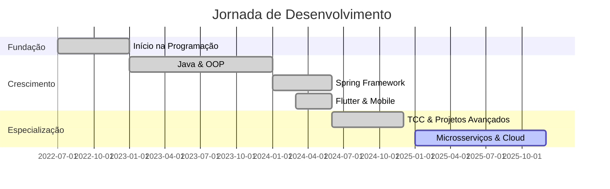

<div align="center">

# 🌌 VENERY GUTIERY // SISTEMA NEURAL V4.0 🌌

```ascii
╔══════════════════════════════════════════════════════════════════╗
║                                                                  ║
║   ██╗   ██╗███████╗███╗   ██╗███████╗██████╗ ██╗   ██╗         ║
║   ██║   ██║██╔════╝████╗  ██║██╔════╝██╔══██╗╚██╗ ██╔╝         ║
║   ██║   ██║█████╗  ██╔██╗ ██║█████╗  ██████╔╝ ╚████╔╝          ║
║   ╚██╗ ██╔╝██╔══╝  ██║╚██╗██║██╔══╝  ██╔══██╗  ╚██╔╝           ║
║    ╚████╔╝ ███████╗██║ ╚████║███████╗██║  ██║   ██║            ║
║     ╚═══╝  ╚══════╝╚═╝  ╚═══╝╚══════╝╚═╝  ╚═╝   ╚═╝            ║
║                                                                  ║
╚══════════════════════════════════════════════════════════════════╝

┌─────────────────────────────────────────────────────────────────┐
│ NEURAL LINK: ████████████████████ 100% SINCRONIZADO             │
│ QUANTUM CORES: ⚡⚡⚡⚡⚡⚡⚡⚡ [TODOS ATIVOS]                    │
│ STATUS: 🟢 ONLINE | CONSTRUINDO O FUTURO                         │
│ LOCALIZAÇÃO: 🇧🇷 CASCAVEL, PR → 🌍 IMPACTO GLOBAL              │
└─────────────────────────────────────────────────────────────────┘
```


[](https://www.linkedin.com/in/venery-gutiery-b02482326/)
[](https://github.com/SERUMANINH0)
[](https://www.instagram.com/venerygutieryy/)
[](mailto:gutieryoficial4@gmail.com)

</div>

---

## 💻 INICIALIZANDO PERFIL...

```java
public class VeneryGutiery {
    private String nome = "Venery Gutiery";
    private int idade = 22;
    private String location = "Cascavel, Paraná, Brasil";
    private String role = "🚀 Desenvolvedor Full Stack | Eng. Software";
    private String[] paixoes = {"Código", "Inovação", "Tecnologia", "Java"};
    
    public String sobreMim() {
        return """
            Desenvolvedor Full Stack formado em Engenharia de Software,
            com experiência sólida em Java, Spring Framework, e desenvolvimento
            web moderno. Apaixonado por criar soluções elegantes e funcionais
            que resolvem problemas reais.
            """;
    }
    
    public Map<String, List<String>> getStack() {
        return Map.of(
            "backend", List.of("Java", "Spring Boot", "Spring Framework", "API REST"),
            "frontend", List.of("HTML5", "CSS3", "JavaScript", "TypeScript", "Dart"),
            "mobile", List.of("Flutter", "Dart"),
            "gamedev", List.of("C#", "Unity", "Game Development"),
            "database", List.of("SQL", "JPQL", "MySQL"),
            "tools", List.of("Git", "VS Code", "IntelliJ", "Postman")
        );
    }
    
    public String objetivo2025() {
        return "Dominar arquitetura de microsserviços e Cloud Native! ☁️";
    }
}
```

---

## 🎯 ARSENAL TECNOLÓGICO

<div align="center">

### 💪 TECNOLOGIAS CORE


### 🚀 FRAMEWORKS & FERRAMENTAS


### 🛠️ DESENVOLVIMENTO


</div>

---

## 🚀 PROJETOS DESTACADOS

<div align="center">

<!-- PROJETO 1 - TCC -->
<details open>
<summary><h3>📚 Sistema TCC - Plataforma Acadêmica</h3></summary>

<br>


```html
<!-- Sistema completo de gerenciamento de TCC -->
<sistema>
  <funcionalidades>
    - Cadastro de alunos e orientadores
    - Gerenciamento de documentos
    - Timeline de entregas
    - Sistema de avaliação
  </funcionalidades>
</sistema>
```

**🎨 Stack:**
`HTML5` • `CSS3` • `JavaScript` • `Backend Integration`

**✨ Features:**
- 📝 Interface intuitiva para gestão acadêmica
- 🔐 Sistema de autenticação
- 📊 Dashboard de acompanhamento
- 📁 Upload e gestão de documentos

[](https://github.com/SERUMANINH0/TCC)
[](https://github.com/SERUMANINH0/TCC_2)

</details>

<!-- PROJETO 2 - Spring Boot Applications -->
<details>
<summary><h3>☕ Ecossistema Spring - APIs RESTful</h3></summary>

<br>


```java
@RestController
@RequestMapping("/api")
public class SpringEcosystem {
    
    // API de Séries com JPQL e SQL
    @GetMapping("/series")
    public ResponseEntity<List<Serie>> getSeries() {
        // Implementação completa de CRUD
        return ResponseEntity.ok(series);
    }
    
    // Tabela FIPE - Integração externa
    @GetMapping("/fipe/{codigo}")
    public Veiculo consultarFipe(@PathVariable String codigo) {
        return fipeService.consultar(codigo);
    }
}
```

**🎨 Stack:**
`Java 1.6-1.8` • `Spring Boot` • `Spring Framework` • `JPQL/SQL` • `REST API`

**✨ Aplicações Desenvolvidas:**
- 🎬 **API de Séries**: CRUD completo com JPQL e queries otimizadas
- 🚗 **Tabela FIPE**: Integração com API externa para consulta de veículos
- 🎵 **Sistema de Música**: Gerenciamento com OOP avançado
- 💳 **Cartão de Crédito**: Sistema de transações e limites

[](https://github.com/SERUMANINH0/Aplica-o_Serie_API_Spring_framework-_JPQL_SQL-_Java_1.8)
[](https://github.com/SERUMANINH0/Aplica-o_TabelaFipe_API_Spring_framework-_Java_1.7)
[](https://github.com/SERUMANINH0/Aplicação_Música_Java_Aula_1.5)

</details>

<!-- PROJETO 3 - Flutter Apps -->
<details>
<summary><h3>📱 Flutter Apps - Mobile Development</h3></summary>

<br>


```dart
class FlutterApps extends StatelessWidget {
  @override
  Widget build(BuildContext context) {
    return MaterialApp(
      title: 'Venery Apps',
      theme: ThemeData.dark(),
      home: Scaffold(
        body: Column(
          children: [
            AnyBankApp(),      // App bancário completo
            NotasApp(),        // Sistema de notas
            CalculadoraApp(),  // Calculadora avançada
          ],
        ),
      ),
    );
  }
}
```

**🎨 Stack:**
`Dart` • `Flutter` • `Material Design` • `OOP`

**✨ Aplicações:**
- 🏦 **AnyBank**: Aplicação bancária com gestão de contas
- 📝 **Sistema de Notas**: App educacional para estudantes
- 🔢 **Calculadora**: Calculadora científica avançada
- 🎯 **POO em Dart**: Projetos focados em Orientação a Objetos

[](https://github.com/SERUMANINH0/anybank_praticando_dart)
[](https://github.com/SERUMANINH0/Aplicacao_notas_dart)
[](https://github.com/SERUMANINH0/calculadora_dardo)

</details>

<!-- PROJETO 4 - Game Development -->
<details>
<summary><h3>🎮 Jogo 2D - Unity Engine</h3></summary>

<br>


```csharp
public class GameController : MonoBehaviour 
{
    private PlayerController player;
    private GameManager gameManager;
    
    void Start() {
        // Sistema de física 2D
        // Mecânicas de movimento
        // Sistema de pontuação
        InitializeGame();
    }
    
    void Update() {
        HandlePlayerInput();
        UpdateGameLogic();
    }
}
```

**🎨 Stack:**
`C#` • `Unity Engine` • `2D Physics` • `Game Design`

**✨ Features:**
- 🎮 Mecânicas de gameplay fluidas
- 🎨 Arte e animações 2D
- 🔊 Sistema de áudio integrado
- 🏆 Sistema de pontuação e conquistas

[](https://github.com/SERUMANINH0/jogo_2d_venery)

</details>

<!-- PROJETO 5 - Portfolio & Web Projects -->
<details>
<summary><h3>🌐 Projetos Web - Full Stack</h3></summary>

<br>


```typescript
interface WebProjects {
  portfolio: {
    tech: ["HTML5", "CSS3", "JavaScript"];
    features: ["Responsivo", "Animações", "SEO"];
  };
  applications: {
    geradorSenhas: "Segurança & Criptografia";
    sistemaNotas: "CRUD completo";
    projetos365dias: "Projetos pessoais";
  };
}
```

**🎨 Projetos Destacados:**
- 💼 **Portfolio**: Website pessoal responsivo
- 🔐 **Gerador de Senhas**: App de segurança
- 📊 **Sistema de Gestão**: Aplicações CRUD
- 🎨 **Estudos CSS**: Layouts modernos e animações

[](https://github.com/SERUMANINH0/portfólio)
[](https://github.com/SERUMANINH0/praticando_css_e_html)

</details>

</div>

---

## 📊 ESTATÍSTICAS NEURAIS

<div align="center">


</div>

<div align="center">

### 🏆 CONQUISTAS GITHUB


</div>

---

## 💡 DOMÍNIO TECNOLÓGICO

```diff
+ Java & Spring Framework     ████████████████████ 95%
+ JavaScript & TypeScript     ██████████████████   85%
+ Flutter & Dart              ████████████████     75%
+ HTML & CSS                  ███████████████████  90%
+ C# & Unity                  ███████████████      70%
+ SQL & JPQL                  ██████████████████   85%
+ REST APIs                   ███████████████████  90%
+ Git & Version Control       ████████████████████ 95%
+ Design Patterns & OOP       ███████████████████  90%
```

---

## 📈 LINHA DO TEMPO



---

## 🎯 OBJETIVOS 2025

<div align="center">

| 🎯 MISSÃO | 📊 PROGRESSO | 🏅 META |
|:-----------|:------------:|:-------------:|
| ☁️ Dominar Spring Cloud & Microsserviços |  | Arquitetura avançada |
| 🐳 Containerização com Docker & K8s |  | DevOps Master |
| 🚀 Contribuir em Open Source |  | 100+ commits |
| 📱 Publicar app Flutter na Play Store |  | App publicado |
| 🎓 Certificação AWS/Azure |  | Cloud Certified |

</div>

---

## 💬 FILOSOFIA DE CÓDIGO

<div align="center">

```
╔═══════════════════════════════════════════════════════════════╗
║                                                               ║
║  "Código limpo não é sobre fazer funcionar,                  ║
║   é sobre fazer funcionar de forma elegante,                 ║
║   mantível e que outros desenvolvedores possam               ║
║   compreender e evoluir."                                    ║
║                                                               ║
║                                     — Clean Code Philosophy  ║
╚═══════════════════════════════════════════════════════════════╝
```

</div>

---

## 🎮 CONQUISTAS DESBLOQUEADAS

<div align="center">


</div>

---

## 🌟 SOBRE MIM

```java
public class AboutMe {
    public static void main(String[] args) {
        Developer venery = new Developer();
        
        System.out.println("👋 Olá! Sou o Venery");
        System.out.println("📍 Cascavel, PR - Brasil");
        System.out.println("🎓 Engenheiro de Software");
        System.out.println("💼 22 anos | Full Stack Developer");
        
        venery.setSpecialties(
            "Java", "Spring Boot", "Flutter", 
            "Web Development", "Game Development"
        );
        
        venery.setPassion("Criar soluções que impactam positivamente");
        venery.setGoal("Arquitetura de software escalável e cloud-native");
        
        System.out.println("\n✨ Sempre aprendendo, sempre evoluindo!");
    }
}
```

---

## 🤝 VAMOS CONECTAR?

<div align="center">

### 💌 Aberto para:
✨ Oportunidades de trabalho  
🤝 Colaborações em projetos  
📚 Mentorias e troca de conhecimento  
🚀 Discussões sobre arquitetura e boas práticas

[](https://www.linkedin.com/in/venery-gutiery-b02482326/)
[](https://www.instagram.com/venerygutieryy/)
[](mailto:gutieryoficial4@gmail.com)

</div>

---

## 📊 MÉTRICAS EM TEMPO REAL

<div align="center">


</div>

---

<div align="center">

## 🚀 PRINCÍPIOS DE DESENVOLVIMENTO

```java
while (alive) {
    learn();
    code();
    refactor();
    deploy();
    improve();
    repeat();
}

// "O código que escrevemos hoje é o legado que deixamos para o futuro"
```

</div>

---

<div align="center">

```
╔═══════════════════════════════════════════════════════════════════╗
║                                                                   ║
║  ⚡ SISTEMA: 100% OPERACIONAL                                     ║
║  🎓 FORMAÇÃO: ENGENHARIA DE SOFTWARE                              ║
║  ☕ ESPECIALIDADE: JAVA & SPRING ECOSYSTEM                        ║
║  🚀 MISSÃO: CÓDIGO LIMPO • ARQUITETURA SÓLIDA • INOVAÇÃO         ║
║  💡 POWERED BY: CAFÉ • CLEAN CODE • CONTINUOUS LEARNING          ║
║                                                                   ║
╚═══════════════════════════════════════════════════════════════════╝
```


### ⭐ Obrigado pela visita! Vamos construir o futuro com código de qualidade! ⭐

**"Simplicidade é o último grau de sofisticação." - Leonardo da Vinci**

</div>
