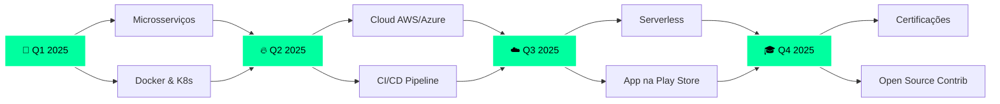

<div align="center">

# 🌌 VENERY GUTIERY 🌌
### `// ENGENHEIRO DE SOFTWARE • ARQUITETO DIGITAL`


```ascii
╔══════════════════════════════════════════════════════════════════════════╗
║                                                                          ║
║     ██╗   ██╗███████╗███╗   ██╗███████╗██████╗ ██╗   ██╗                ║
║     ██║   ██║██╔════╝████╗  ██║██╔════╝██╔══██╗╚██╗ ██╔╝                ║
║     ██║   ██║█████╗  ██╔██╗ ██║█████╗  ██████╔╝ ╚████╔╝                 ║
║     ╚██╗ ██╔╝██╔══╝  ██║╚██╗██║██╔══╝  ██╔══██╗  ╚██╔╝                  ║
║      ╚████╔╝ ███████╗██║ ╚████║███████╗██║  ██║   ██║    v4.0           ║
║       ╚═══╝  ╚══════╝╚═╝  ╚═══╝╚══════╝╚═╝  ╚═╝   ╚═╝                   ║
║                                                                          ║
║  ┌────────────────────────────────────────────────────────────────┐    ║
║  │  STATUS      : ████████████████████████ 100% ONLINE           │    ║
║  │  CORES       : ⚡⚡⚡⚡⚡⚡⚡⚡ [8/8 ATIVOS]                   │    ║
║  │  LOCATION    : 🇧🇷 Cascavel, PR → 🌍 Global Impact           │    ║
║  │  MISSION     : Transformando café em código desde 2022        │    ║
║  └────────────────────────────────────────────────────────────────┘    ║
║                                                                          ║
╚══════════════════════════════════════════════════════════════════════════╝
```

<br>

<a href="https://www.linkedin.com/in/venery-gutiery-b02482326/">
  
</a>
<a href="https://github.com/SERUMANINH0">
  
</a>
<a href="https://www.instagram.com/venerygutieryy/">
  
</a>
<a href="mailto:gutieryoficial4@gmail.com">
  
</a>

<br><br>


</div>

---


## 👨‍💻 `$ whoami`

```java
@SpringBootApplication
public class VeneryGutiery {
    
    @Value("${developer.info}")
    private DeveloperInfo info = DeveloperInfo.builder()
        .name("Venery Gutiery")
        .age(22)
        .location("Cascavel, PR 🇧🇷")
        .education("Engenharia de Software")
        .role("Full Stack Developer")
        .experience("3+ anos")
        .passion("Criar soluções elegantes")
        .build();
    
    public static void main(String[] args) {
        SpringApplication.run(VeneryGutiery.class, args);
        System.out.println("🚀 Sistema inicializado!");
        System.out.println("☕ Transformando café em código...");
    }
}
```

<br clear="right"/>

---

## 🛠️ **TECH STACK ARSENAL**

<div align="center">

### 🔥 **CORE TECHNOLOGIES**

<table>
<tr>
<td align="center" width="96">

<br>Java
</td>
<td align="center" width="96">

<br>Spring
</td>
<td align="center" width="96">

<br>JavaScript
</td>
<td align="center" width="96">

<br>TypeScript
</td>
<td align="center" width="96">

<br>Dart
</td>
<td align="center" width="96">

<br>C#
</td>
<td align="center" width="96">

<br>Python
</td>
</tr>
</table>

### 📱 **FRAMEWORKS & PLATFORMS**

<table>
<tr>
<td align="center" width="96">

<br>Flutter
</td>
<td align="center" width="96">

<br>Unity
</td>
<td align="center" width="96">

<br>React
</td>
<td align="center" width="96">

<br>Node.js
</td>
<td align="center" width="96">

<br>MySQL
</td>
<td align="center" width="96">

<br>MongoDB
</td>
<td align="center" width="96">

<br>PostgreSQL
</td>
</tr>
</table>

### 🎨 **FRONTEND & DESIGN**

<table>
<tr>
<td align="center" width="96">

<br>HTML5
</td>
<td align="center" width="96">

<br>CSS3
</td>
<td align="center" width="96">

<br>Tailwind
</td>
<td align="center" width="96">

<br>Bootstrap
</td>
<td align="center" width="96">

<br>Figma
</td>
<td align="center" width="96">

<br>Sass
</td>
</tr>
</table>

### 🔧 **TOOLS & DEVOPS**

<table>
<tr>
<td align="center" width="96">

<br>Git
</td>
<td align="center" width="96">

<br>GitHub
</td>
<td align="center" width="96">

<br>Docker
</td>
<td align="center" width="96">

<br>VS Code
</td>
<td align="center" width="96">

<br>IntelliJ
</td>
<td align="center" width="96">

<br>Postman
</td>
<td align="center" width="96">

<br>Linux
</td>
</tr>
</table>

</div>

---

## 📊 **GITHUB ANALYTICS**

<div align="center">
   
  
</div>

<div align="center">
  
</div>

<div align="center">
  
</div>

<div align="center">
<br>
  
</div>

---

## 🚀 **PROJETOS EM DESTAQUE**

<div align="center">

<table>
<tr>
<td width="50%">

<h3 align="center">☕ Spring Boot Ecosystem</h3>

<div align="center">  
<a href="https://github.com/SERUMANINH0/Aplica-o_Serie_API_Spring_framework-_JPQL_SQL-_Java_1.8">

</a>
</div>

**Tech Stack:**


**Features:**
- 🎬 API REST completa de séries
- 🔍 Queries JPQL otimizadas
- 📊 Integração com banco de dados
- 🔐 Sistema de autenticação

</td>

<td width="50%">

<h3 align="center">📱 Flutter Mobile Apps</h3>

<div align="center">
<a href="https://github.com/SERUMANINH0/anybank_praticando_dart">

</a>
</div>

**Tech Stack:**


**Features:**
- 🏦 App bancário completo
- 💳 Gestão de transações
- 📊 Dashboard interativo
- 🎨 Material Design 3

</td>
</tr>

<tr>
<td width="50%">

<h3 align="center">🎮 Unity 2D Game</h3>

<div align="center">
<a href="https://github.com/SERUMANINH0/jogo_2d_venery">

</a>
</div>

**Tech Stack:**


**Features:**
- 🎮 Mecânicas de gameplay fluidas
- 🎨 Arte e animações 2D
- 🔊 Sistema de áudio integrado
- 🏆 Sistema de pontuação

</td>

<td width="50%">

<h3 align="center">🌐 Portfolio & Web Projects</h3>

<div align="center">
<a href="https://github.com/SERUMANINH0/TCC">

</a>
</div>

**Tech Stack:**


**Features:**
- 📚 Sistema acadêmico completo
- 📝 Gestão de documentos
- 👥 Multi-usuários
- 📊 Dashboard administrativo

</td>
</tr>
</table>

</div>

---

## 💡 **SKILL LEVELS**

<div align="center">

```ascii
╔═══════════════════════════════════════════════════════════════════╗
║                                                                   ║
║  Java & Spring Boot        ████████████████████░ 95%             ║
║  JavaScript & TypeScript   █████████████████░░░░ 85%             ║
║  Flutter & Dart            ███████████████░░░░░░ 75%             ║
║  HTML & CSS                ██████████████████░░░ 90%             ║
║  C# & Unity                ██████████████░░░░░░░ 70%             ║
║  SQL & Databases           █████████████████░░░░ 85%             ║
║  REST APIs                 ██████████████████░░░ 90%             ║
║  Git & DevOps              ████████████████████░ 95%             ║
║  Design Patterns & OOP     ██████████████████░░░ 90%             ║
║  Problem Solving           ████████████████████░ 95%             ║
║                                                                   ║
╚═══════════════════════════════════════════════════════════════════╝
```

</div>

---

## 🎯 **2025 ROADMAP**

<div align="center">



</div>

<br>

<div align="center">

| 🎯 **OBJETIVO** | 📊 **PROGRESSO** | 🗓️ **PRAZO** | 🏆 **STATUS** |
|:----------------|:---------------:|:-------------:|:-------------:|
| ☁️ Dominar Spring Cloud |  | Q2 2025 | 🟡 Em Progresso |
| 🐳 Docker & Kubernetes |  | Q2 2025 | 🟡 Iniciado |
| 🚀 100+ Commits OSS |  | Q4 2025 | 🟢 Ativo |
| 📱 App na Play Store |  | Q3 2025 | 🟡 Desenvolvimento |
| 🎓 Cert. AWS/Azure |  | Q4 2025 | 🟢 Estudando |

</div>

---

## 🏆 **CONQUISTAS & BADGES**

<div align="center">


</div>

---

## 💭 **FILOSOFIA DE CÓDIGO**

<div align="center">

```
╔═══════════════════════════════════════════════════════════════════════╗
║                                                                       ║
║  "Clean code is not written by following a set of rules.             ║
║   You don't become a software craftsman by learning a list of        ║
║   what to do and what not to do. Professionalism and craftsmanship   ║
║   come from values that drive disciplines."                          ║
║                                                                       ║
║                                            — Robert C. Martin         ║
║                                                                       ║
╚═══════════════════════════════════════════════════════════════════════╝
```

<br>

### 🎯 **PRINCÍPIOS QUE SIGO:**

**SOLID** • **Clean Code** • **DRY** • **KISS** • **YAGNI** • **TDD**

</div>

---

## 📫 **VAMOS CONECTAR?**

<div align="center">

### 💼 **Aberto para:**

```typescript
const opportunities = {
  lookingFor: [
    "💼 Oportunidades de trabalho Full Stack",
    "🤝 Colaborações em projetos Open Source",
    "📚 Mentorias e troca de conhecimento",
    "🚀 Discussões sobre arquitetura e boas práticas",
    "☕ Bater um papo sobre tecnologia"
  ],
  canHelpWith: [
    "Java & Spring Boot development",
    "Mobile development com Flutter",
    "REST API design & implementation",
    "Code reviews & refactoring",
    "Orientação a Objetos & Design Patterns"
  ]
};
```

<br>

[](https://www.linkedin.com/in/venery-gutiery-b02482326/)
[](https://www.instagram.com/venerygutieryy/)
[](mailto:gutieryoficial4@gmail.com)
[](https://github.com/SERUMANINH0)

</div>

---

## 📈 **VISITOR & ACTIVITY METRICS**

<div align="center">


<br>

[](https://github.com/SERUMANINH0)

</div>

---

<div align="center">

## 🐍 **CONTRIBUTION SNAKE**

<picture>
  <source media="(prefers-color-scheme: dark)" srcset="https://github.com/SERUMANINH0/SERUMANINH0/blob/main/.github/workflows/snake.yml">
  <source media="(prefers-color-scheme: light)" srcset="https://github.com/SERUMANINH0/SERUMANINH0/blob/main/.github/workflows/snake.yml">
  
</picture>

</div>

---

<div align="center">

## 💻 **CÓDIGO É MINHA LINGUAGEM**

```java
public class Developer {
    public static void main(String[] args) {
        while (alive) {
            eat("☕");
            code();
            learn();
            create();
            sleep(); // às vezes...
            repeat();
        }
        
        System.out.println("🚀 Transformando ideias em realidade, uma linha por vez!");
    }
}
```

<br>

```
╔═══════════════════════════════════════════════════════════════════════╗
║                                                                       ║
║  ⚡ SISTEMA: 100% OPERACIONAL                                         ║
║  🎓 FORMAÇÃO: ENGENHARIA DE SOFTWARE                                  ║
║  ☕ STACK: JAVA • SPRING • FLUTTER • UNITY                            ║
║  🚀 MISSÃO: CLEAN CODE • SOLID PRINCIPLES • INNOVATION                ║
║  💡 POWERED BY: CAFÉ ☕ • CÓDIGO 💻 • CONTINUOUS LEARNING 📚         ║
║                                                                       ║
╚═══════════════════════════════════════════════════════════════════════╝
```

<br>


### ⭐ **Obrigado pela visita! Vamos construir o futuro juntos!** ⭐

**"A jornada de mil linhas de código começa com um único commit."**

<br>

[](https://github.com/SERUMANINH0/SERUMANINH0)

</div>
