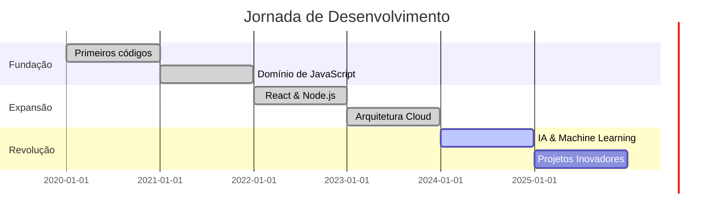

# <div align="center">⚡ SISTEMA NEURAL ONLINE ⚡</div>

<div align="center">
  
```ascii
╔═══════════════════════════════════════════════════════════════╗
║  ███╗   ██╗███████╗██╗   ██╗██████╗  █████╗ ██╗              ║
║  ████╗  ██║██╔════╝██║   ██║██╔══██╗██╔══██╗██║              ║
║  ██╔██╗ ██║█████╗  ██║   ██║██████╔╝███████║██║              ║
║  ██║╚██╗██║██╔══╝  ██║   ██║██╔══██╗██╔══██║██║              ║
║  ██║ ╚████║███████╗╚██████╔╝██║  ██║██║  ██║███████╗         ║
║  ╚═╝  ╚═══╝╚══════╝ ╚═════╝ ╚═╝  ╚═╝╚═╝  ╚═╝╚══════╝         ║
╚═══════════════════════════════════════════════════════════════╝
    [ INICIALIZANDO CONSCIÊNCIA DIGITAL... ▓▓▓▓▓▓▓░░░ 73% ]
```

</div>

<div align="center">
  
### `$ whoami`

```javascript
const desenvolvedor = {
  nome: "SEU_NOME_AQUI",
  papel: "Arquiteto de Realidades Digitais",
  status: "🟢 ATIVO | CODIFICANDO O IMPOSSÍVEL",
  localização: "Nuvem Híbrida // Servidor Principal: Brasil",
  missão: "Transformar café em código revolucionário"
};
```

</div>

---

## 🔥 CORE SYSTEM // HABILIDADES NEURAIS

<div align="center">

| **LINGUAGENS** | **FRAMEWORKS** | **FERRAMENTAS** |
|:---:|:---:|:---:|
|  |  |  |
|  |  |  |
|  |  |  |

</div>

---

## 🚀 PROJETOS DIMENSIONAIS

<table>
<tr>
<td width="50%">

### 🌐 [PROJETO QUANTUM](https://github.com/seu-usuario/projeto-1)

```python
# Sistema de IA revolucionário
class FuturoDigital:
    def __init__(self):
        self.potencial = "INFINITO"
        self.impacto = "MUNDIAL"
```

**Stack:** `Python` `TensorFlow` `FastAPI`  
**Status:** 🟢 Em Produção

</td>
<td width="50%">

### ⚡ [NEXUS PLATFORM](https://github.com/seu-usuario/projeto-2)

```javascript
// Plataforma de conexão global
const nexus = {
  usuarios: "1M+",
  velocidade: "light-speed",
  futuro: true
};
```

**Stack:** `React` `Node.js` `MongoDB`  
**Status:** 🟡 Beta Testing

</td>
</tr>
<tr>
<td width="50%">

### 🎮 [REALIDADE AUMENTADA](https://github.com/seu-usuario/projeto-3)

```typescript
// Experiência imersiva next-gen
interface MetaVerse {
  dimensoes: number;
  realidade: 'virtual' | 'aumentada';
  revolucao: boolean;
}
```

**Stack:** `TypeScript` `Three.js` `WebXR`  
**Status:** 🔴 Experimental

</td>
<td width="50%">

### 🧠 [NEURAL ENGINE](https://github.com/seu-usuario/projeto-4)

```rust
// Motor de processamento quântico
fn processar_futuro() -> Result<(), Error> {
    loop {
        inovar();
        revolucionar();
    }
}
```

**Stack:** `Rust` `WebAssembly` `CUDA`  
**Status:** 🟢 Ativo

</td>
</tr>
</table>

---

## 📡 TELEMETRIA DO SISTEMA

<div align="center">


</div>

---

## 💭 PENSAMENTO DO DIA

<div align="center">

```
┌─────────────────────────────────────────────────────────────┐
│  "O código é poesia em movimento, e cada bug é apenas       │
│   uma oportunidade de criar algo ainda mais extraordinário" │
│                                                              │
│                                        - Neural System v2.0  │
└─────────────────────────────────────────────────────────────┘
```

</div>

---

## 🌈 LINHA DO TEMPO EVOLUTIVA



---

## 🎯 MISSÕES ATIVAS

<div align="center">

| MISSÃO | PROGRESSO | ETA |
|:-------|:---------:|:---:|
| 🔮 Dominar arquitetura serverless | ████████░░ 80% | Q1 2025 |
| 🚀 Lançar startup tech | ██████░░░░ 60% | Q2 2025 |
| 🧬 Criar IA revolucionária | ███░░░░░░░ 30% | Q4 2025 |
| 🌍 Contribuir 1000+ commits OSS | ████████░░ 75% | Dez 2025 |

</div>

---

## 🔗 PORTAIS DE COMUNICAÇÃO

<div align="center">

[](https://linkedin.com/in/seu-perfil)
[](https://seu-portfolio.com)
[](https://twitter.com/seu-usuario)
[](mailto:seu@email.com)

</div>

---

## 🎮 CONQUISTAS DESBLOQUEADAS

<div align="center">


</div>

---

<div align="center">

### ⚡ STATUS DO SISTEMA ⚡

```
[████████████████████████████████████] 100%
 NEURAL LINK ESTABLISHED | READY FOR INNOVATION
```

### 🎯 Colaboração é a chave do futuro

```javascript
if (você.interesse === "colaborar" || você.ideia === "revolucionária") {
  console.log("💡 Vamos criar algo extraordinário juntos!");
  const projeto = new Colaboracao(eu, você);
  projeto.iniciar();
}
```

[](https://github.com/SEU_USUARIO)
[](https://github.com/SEU_USUARIO)

---

```
┌───────────────────────────────────────────────────────────────┐
│  ⚡ POWERED BY INNOVATION • FUELED BY COFFEE • DRIVEN BY CODE ⚡ │
└───────────────────────────────────────────────────────────────┘
```

</div>
